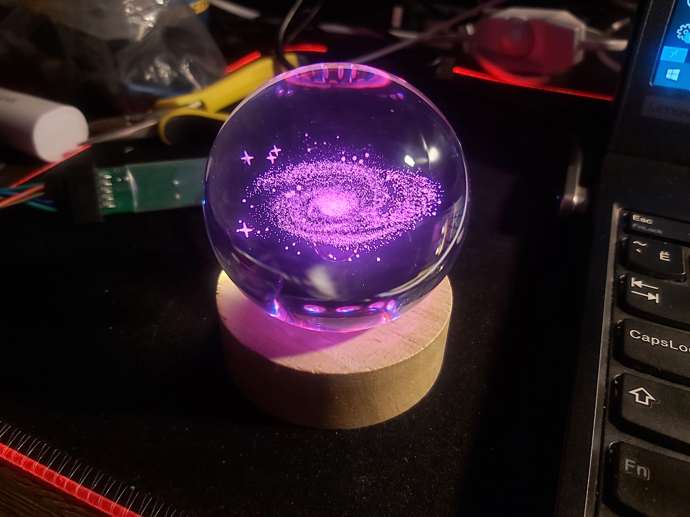
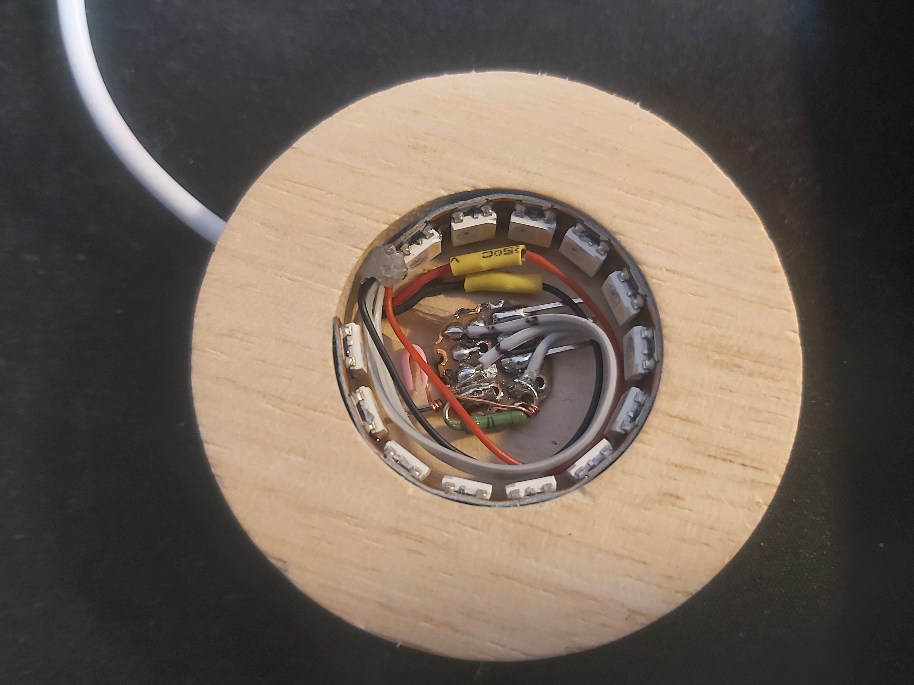
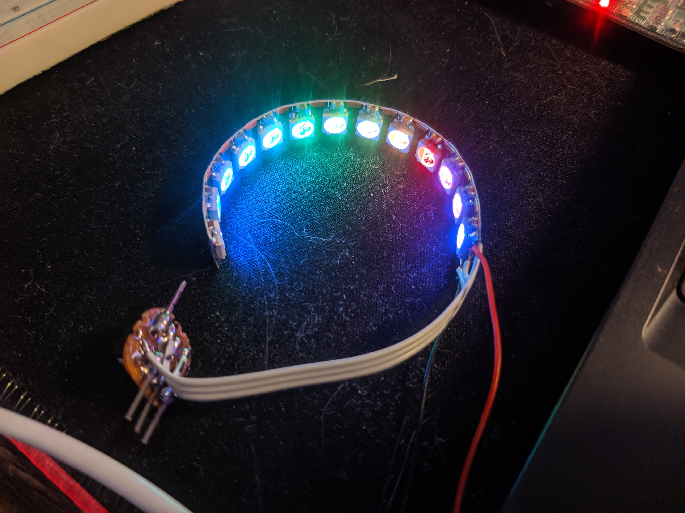
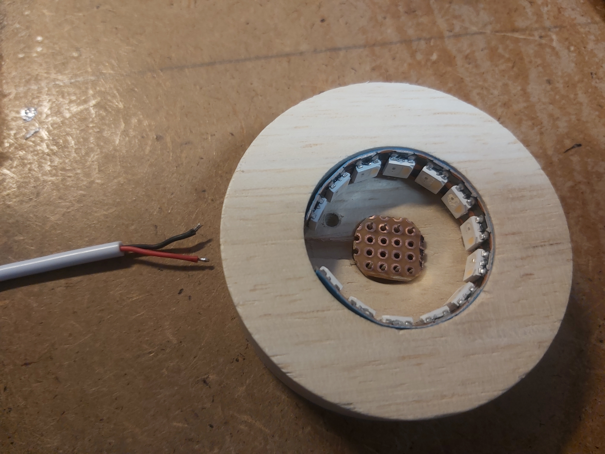
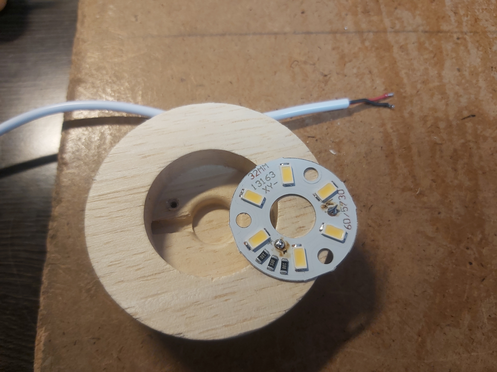

# Glowing ball
  
  

New leds and firmware for glowing ball based on ATtiny13 microcontroller.  
No Arduino framework or lins were used because of low amount of microcontroller's memory.  
RGBW Neo-Pixel compaible led strip was used.  

~~Light slowly goes from red to green to blue while pulses with white.~~  
Slowly change colors started from one side, while maintain max possible brightness  

Based on https://github.com/wagiminator/ATtiny13-NeoController    

Video demo:  
https://youtu.be/HeBRopewjwI  
  

Link to ball at online store (non-referal)  
https://ozon.ru/t/P2VLye6  

## Making of

Assembled:  
  

Testing and debugging microcontroller and led strip:  
  

Testing how led strip fits:  
 

Original hardware (simple white leds):  
 
